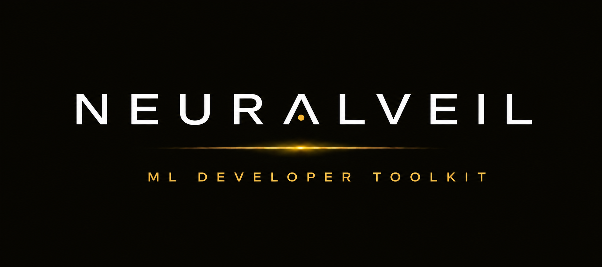

<div align="center">





**The open-source toolkit for ML engineers to visualize, diff, and memory-profile neural network architectures.**

<br />

[](https://pypi.org/project/neuralveil/)
[](https://pypi.org/project/neuralveil/)
[](./LICENSE)
[](https://pypi.org/project/neuralveil/)
[](https://github.com/YOUR_USERNAME/neuralveil/stargazers)

[neuralveil.dev](https://neuralveil.dev) &nbsp;·&nbsp; [PyPI](https://pypi.org/project/neuralveil/) &nbsp;·&nbsp; [Issues](https://github.com/YOUR_USERNAME/neuralveil/issues)

</div>

---

NeuralVeil captures your model's **actual runtime computation graph** — not a static approximation — and gives you an interactive canvas to explore it, diff it across versions, and estimate its GPU memory footprint before you run a single training job.

No telemetry. No cloud. Your model never leaves your machine.

---

## Install

```bash
pip install neuralveil
```

## Usage

```bash
neuralveil parse model.py --input 1,3,225,225 --output model.json
```

Upload `model.json` to [neuralveil.dev](https://neuralveil.dev).

---

## How it works

The CLI traces your PyTorch model at runtime using `torch.fx` symbolic tracing, with a forward hook fallback for dynamic and non-traceable models. Every node in the graph carries the full operator metadata — shape, dtype, parameter count, memory footprint — serialized to a portable JSON schema.

The frontend parses that JSON and renders it as an interactive graph using React Flow with ELK layout, which means skip connections, residual blocks, and multi-branch architectures all route correctly without overlap or manual intervention.

> TensorFlow support is in active development.

---

## Tensor Shape Debugger

```bash
neuralveil parse resnet50.py --input 1,3,224,224 --output resnet50.json
```

- Captures the real execution graph, not inferred from `__init__`
- Handles skip connections, residual blocks, reshape, permute
- Symbolic batch dimension — not hardcoded to your dummy input
- Full per-node metadata: shape, dtype, params, memory
- Named snapshots and node-level architecture diffs across model versions
- Undo / redo on the canvas (`Ctrl+Z` / `Ctrl+Y`)

---

## GPU Memory Estimator

Estimate VRAM requirements across GPUs, optimizers, and training configs before you run anything.

```
Total VRAM = Parameters + Activations + Gradients + Optimizer State
```

Most estimators only count parameters. NeuralVeil accounts for all four buckets, with per-layer mixed precision and optimizer-aware state sizing.

**Supported GPUs** — A100 40GB · A100 80GB · H100 80GB · RTX 4090 · V100 16GB · V100 32GB  
**Optimizers** — Adam · AdamW · SGD · Adafactor  
**Mixed precision** — FP32 / FP16 / BF16 per layer  
**Gradient checkpointing** — memory vs. compute tradeoff modeling  
**Multi-GPU** — FSDP / DDP / Tensor Parallel memory breakdown  
**HuggingFace import** — load directly from a model card  
**Cloud cost** — $/hr × memory fit across AWS, GCP, Lambda  
**Config export** — generate a ready-to-run PyTorch training config  
**Exportable Report** — full memory consumption report ready to be exported in both .csv and .pdf format.  

Available at [neuralveil.dev](https://neuralveil.dev) — no install required.

---

## Compared to alternatives

| | NeuralVeil | Netron | TensorBoard |
|---|---|---|---|
| Runtime graph capture | ✅ | ❌ | ❌ |
| Skip connection routing | ✅ | partial | partial |
| Architecture diff | ✅ | ❌ | ❌ |
| GPU memory estimator | ✅ | ❌ | ❌ |
| Multi-GPU memory modeling | ✅ | ❌ | ❌ |
| Offline / air-gapped | ✅ | ✅ | ❌ |
| No telemetry | ✅ | ✅ | ❌ |

---

## Contributing

For the frontend:

```bash
git clone https://github.com/gyan-js/neuralveil
cd neuralveil
npm install 
npm run dev
```

For the Neuralveil's CLI

```bash
git clone https://github.com/gyan-js/neuralveil-cli
cd neuralveil-cli
pip install -e
```


---

## License

[Apache 2.0](./LICENSE)